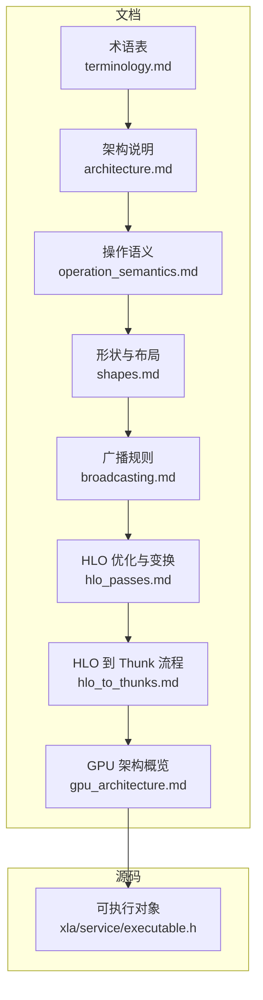
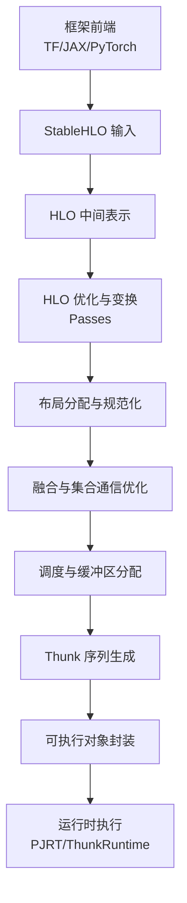
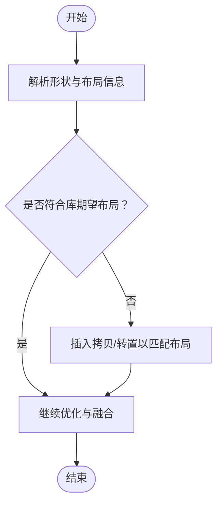
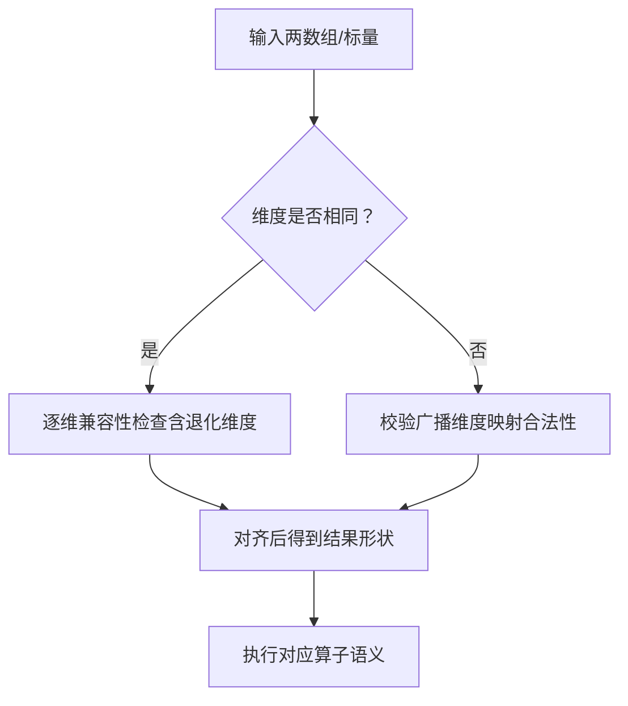
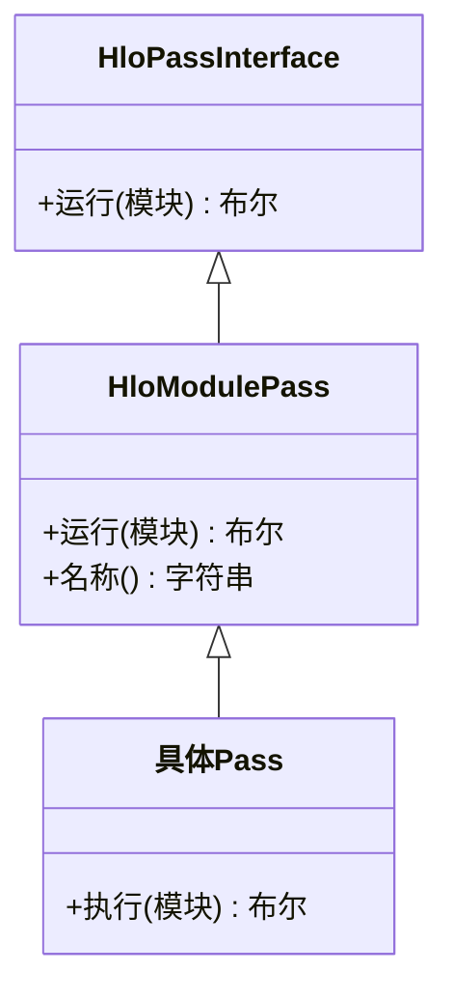
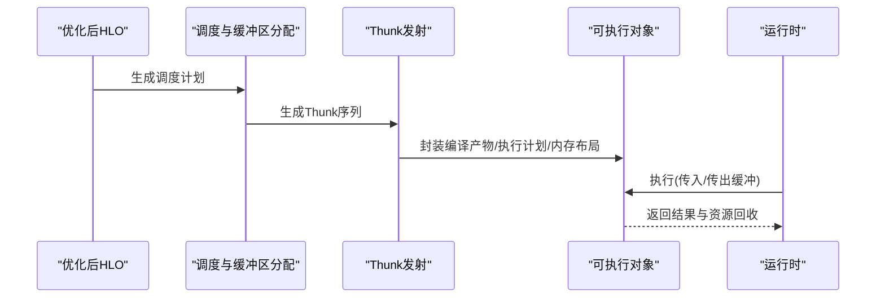
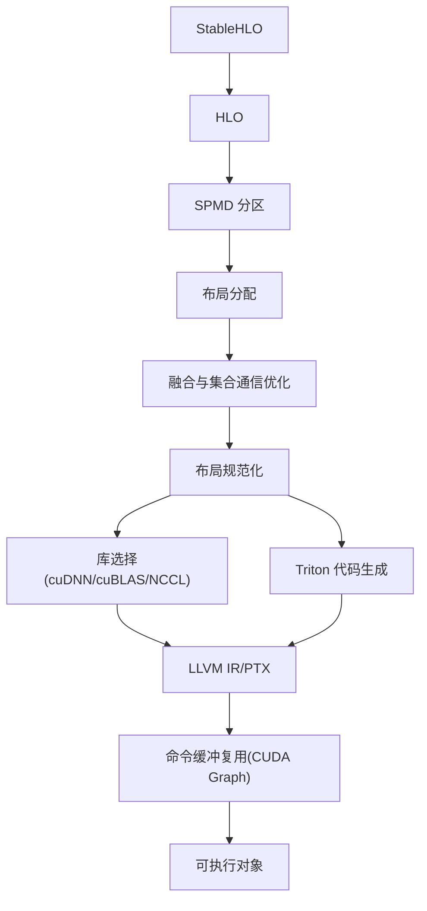

# 核心概念

<cite>
**本文引用的文件**
- [README.md](file://README.md)
- [docs/index.md](file://docs/index.md)
- [docs/architecture.md](file://docs/architecture.md)
- [docs/terminology.md](file://docs/terminology.md)
- [docs/operation_semantics.md](file://docs/operation_semantics.md)
- [docs/shapes.md](file://docs/shapes.md)
- [docs/broadcasting.md](file://docs/broadcasting.md)
- [docs/hlo_passes.md](file://docs/hlo_passes.md)
- [docs/hlo_to_thunks.md](file://docs/hlo_to_thunks.md)
- [docs/gpu_architecture.md](file://docs/gpu_architecture.md)
- [xla/service/executable.h](file://xla/service/executable.h)
</cite>

## 目录
1. [引言](#引言)
2. [项目结构](#项目结构)
3. [核心组件](#核心组件)
4. [架构总览](#架构总览)
5. [详细组件分析](#详细组件分析)
6. [依赖关系分析](#依赖关系分析)
7. [性能考量](#性能考量)
8. [故障排查指南](#故障排查指南)
9. [结论](#结论)
10. [附录](#附录)

## 引言
XLA（Accelerated Linear Algebra）是面向机器学习的跨硬件加速编译器，负责将来自主流框架（如 PyTorch、TensorFlow、JAX）的模型图，通过一系列优化与变换，生成可在不同硬件平台（CPU/GPU/专用加速器）上高效执行的目标代码。其核心价值在于：提升执行速度、降低内存占用、减少对自定义算子的依赖、增强可移植性，并以 MLIR 为统一基础设施简化工具链复杂度。

本节概述了 XLA 的基本定位与目标，便于初学者快速建立整体认知。

**章节来源**
- file://README.md#L1-L50
- file://docs/index.md#L1-L39

## 项目结构
从仓库组织看，XLA 的文档与源码围绕“前端接口（StableHLO/CHLO/VHLO/MHLO/HLO）—中间表示（HLO）—后端代码生成（LLVM/Triton/cuDNN 等）—运行时（PJRT/Thunk/Executable）”这一主线展开。关键模块包括：
- 文档层：术语表、架构说明、操作语义、形状与布局、广播规则、HLO 优化与变换、HLO 到 Thunk 的流程、GPU 架构概览等。
- 源码层：服务端可执行对象、编译管线、后端适配、运行时抽象等。

**图表来源**
- [docs/terminology.md](file://docs/terminology.md#L1-L69)
- [docs/architecture.md](file://docs/architecture.md#L1-L72)
- [docs/operation_semantics.md](file://docs/operation_semantics.md#L1-L800)
- [docs/shapes.md](file://docs/shapes.md#L1-L205)
- [docs/broadcasting.md](file://docs/broadcasting.md#L1-L207)
- [docs/hlo_passes.md](file://docs/hlo_passes.md#L1-L231)
- [docs/hlo_to_thunks.md](file://docs/hlo_to_thunks.md#L1-L278)
- [docs/gpu_architecture.md](file://docs/gpu_architecture.md#L1-L254)
- [xla/service/executable.h](file://xla/service/executable.h#L1-L200)

**章节来源**
- file://docs/terminology.md#L1-L69
- file://docs/architecture.md#L1-L72
- file://docs/hlo_passes.md#L1-L231
- file://docs/hlo_to_thunks.md#L1-L278
- file://docs/gpu_architecture.md#L1-L254
- file://xla/service/executable.h#L1-L200

## 核心组件
- 高层优化器（HLO）与 StableHLO
  - HLO 是 XLA 内部的图表示；StableHLO 提供跨框架的稳定接口，二者在编译流程中相互转换。
  - 参考：术语表、架构说明、HLO 优化与变换、HLO 到 Thunk 流程。
- 形状与布局（Shape/Layout）
  - 描述张量的维度、元素类型与内存布局（minor-to-major、填充、内存空间标识等），直接影响访存效率与融合策略。
  - 参考：形状与布局、广播规则。
- 广播（Broadcasting）
  - 明确不同形状数组之间的兼容性与对齐方式，避免隐式行为，确保可组合性与可预测性。
  - 参考：广播规则。
- HLO 优化与变换（Passes）
  - 包括常量折叠、死代码消除、重计算替代、布局分配、融合、集合通信优化等，贯穿目标无关与目标相关阶段。
  - 参考：HLO 优化与变换。
- Thunk 序列与可执行对象
  - 将调度后的 HLO 降级为后端可执行的 Thunk 序列；最终封装为可执行对象，承载编译产物、执行计划与内存布局元数据。
  - 参考：HLO 到 Thunk 流程、可执行对象。

**章节来源**
- file://docs/terminology.md#L1-L69
- file://docs/architecture.md#L1-L72
- file://docs/shapes.md#L1-L205
- file://docs/broadcasting.md#L1-L207
- file://docs/hlo_passes.md#L1-L231
- file://docs/hlo_to_thunks.md#L1-L278
- file://xla/service/executable.h#L1-L200

## 架构总览
下图展示了从框架输入到后端执行的整体路径，强调 StableHLO 作为前端与后端的桥梁、HLO 中间表示的优化与变换、以及 Thunk 执行序列的生成与封装。

**图表来源**
- [docs/architecture.md](file://docs/architecture.md#L35-L72)
- [docs/hlo_passes.md](file://docs/hlo_passes.md#L1-L231)
- [docs/hlo_to_thunks.md](file://docs/hlo_to_thunks.md#L1-L278)
- [docs/gpu_architecture.md](file://docs/gpu_architecture.md#L20-L254)

**章节来源**
- file://docs/architecture.md#L35-L72
- file://docs/hlo_to_thunks.md#L1-L278
- file://docs/gpu_architecture.md#L20-L254

## 详细组件分析

### 组件一：张量计算与形状/布局
- 形状（Shape）描述张量的维度与元素类型；布局（Layout）描述物理内存排列顺序（minor-to-major）、填充与内存空间标识（如设备高带宽内存、设备虚拟内存、主机内存等）。
- 布局影响访存模式与融合机会；默认布局通常采用 major-to-minor 排序；非默认布局可能需要显式转置或位视图（bitcast）来匹配库调用期望。
- 示例参考：形状与布局文档中的布局语法、内存空间标识与索引工具。

**图表来源**
- [docs/shapes.md](file://docs/shapes.md#L117-L205)
- [docs/hlo_to_thunks.md](file://docs/hlo_to_thunks.md#L43-L90)

**章节来源**
- file://docs/shapes.md#L1-L205
- file://docs/hlo_to_thunks.md#L43-L90

### 组件二：广播与语义一致性
- 广播用于在不同形状之间进行算子对齐，要求明确指定广播维度，避免隐式推断，确保可组合性与可预测性。
- 操作语义文档列举了常见算子（如加法、逻辑运算、归约、批量归一化等）的输入输出约束与边界条件，是理解张量计算正确性的基础。

**图表来源**
- [docs/broadcasting.md](file://docs/broadcasting.md#L34-L207)
- [docs/operation_semantics.md](file://docs/operation_semantics.md#L1-L800)

**章节来源**
- file://docs/broadcasting.md#L1-L207
- file://docs/operation_semantics.md#L1-L800

### 组件三：HLO 优化与变换（Passes）
- 目标无关优化：如代数简化、常量折叠、死代码消除、调用图扁平化、reshape 移动、零尺寸消除等。
- 目标相关优化：如 cuDNN 融合、TPU bfloat16 精度传播、SPMD 分区、集合通信优化等。
- 分析类 Pass：数据流分析、别名分析、成本估算、HLO 校验等，支撑优化决策与正确性保障。

**图表来源**
- [docs/hlo_passes.md](file://docs/hlo_passes.md#L28-L47)

**章节来源**
- file://docs/hlo_passes.md#L1-L231

### 组件四：从 HLO 到 Thunk 的执行序列
- 优化后 HLO 进入调度与缓冲区分配阶段，随后被降级为 Thunk 序列；GPU 后端常结合命令缓冲（Command Buffer）复用内核启动开销；最终封装为可执行对象，包含编译代码、执行计划与内存布局元数据。
- 可执行对象承载输入/输出缓冲、动态形状、捐赠缓冲策略与释放清单等，是运行时与编译器之间的桥接。

**图表来源**
- [docs/hlo_to_thunks.md](file://docs/hlo_to_thunks.md#L125-L278)
- [xla/service/executable.h](file://xla/service/executable.h#L52-L200)

**章节来源**
- file://docs/hlo_to_thunks.md#L1-L278
- file://xla/service/executable.h#L1-L200

### 组件五：GPU 后端流水线与融合
- GPU 后端结合 LLVM/PTX、cuDNN、Triton 等技术栈，通过布局分配、融合、集合通信优化与命令缓冲复用，实现近带宽极限的执行性能。
- 典型流程：SPMD 分区、布局分配、融合、布局规范化、库选择与直接代码生成、Triton 优化与 PTX 生成、CUDA 图提取与运行时 IR 编译。

**图表来源**
- [docs/gpu_architecture.md](file://docs/gpu_architecture.md#L20-L254)
- [docs/hlo_to_thunks.md](file://docs/hlo_to_thunks.md#L178-L278)

**章节来源**
- file://docs/gpu_architecture.md#L20-L254
- file://docs/hlo_to_thunks.md#L178-L278

## 依赖关系分析
- 前端到中间表示：框架通过 StableHLO 将高层语义标准化为 HLO，再进行目标无关优化。
- 中间表示到后端：HLO 在后端进一步进行目标相关优化与布局规范化，随后发射为 Thunk 序列。
- 运行时集成：可执行对象封装编译产物与执行计划，运行时通过 PJRT 等接口驱动执行。

**图表来源**
- [docs/architecture.md](file://docs/architecture.md#L35-L72)
- [docs/hlo_to_thunks.md](file://docs/hlo_to_thunks.md#L168-L278)

**章节来源**
- file://docs/architecture.md#L35-L72
- file://docs/hlo_to_thunks.md#L168-L278

## 性能考量
- 融合优先：通过融合减少中间结果写回 HBM 的次数，显著降低内存带宽压力。
- 布局优化：合理的 minor-to-major 排列与内存对齐可提升缓存命中率与寄存器利用率。
- 重计算替代：在内存受限场景，以计算换内存，缓解峰值内存压力。
- 库融合与直接代码生成：对热点算子优先走高性能库（如 cuDNN/cuBLAS），对复杂融合场景使用 Triton 生成定制内核。
- 命令缓冲复用：在 GPU 上记录并复用内核启动序列，降低启动开销。

**章节来源**
- file://docs/hlo_passes.md#L57-L117
- file://docs/hlo_to_thunks.md#L178-L278
- file://docs/gpu_architecture.md#L155-L254

## 故障排查指南
- HLO 校验与验证：使用 HLO 验证器检查图不变式，定位布局冲突、非法形状或无效集合通信配置。
- 数据流与别名分析：借助数据流分析与别名分析识别潜在的缓冲区覆盖与生命周期冲突。
- 调试与转储：利用编译标志输出预优化与优化后 HLO、缓冲区分配信息，辅助定位问题。
- 可执行对象状态：确认输入/输出缓冲状态、动态形状与捐赠缓冲策略，避免运行时悬挂或泄漏。

**章节来源**
- file://docs/hlo_passes.md#L196-L231
- file://docs/hlo_to_thunks.md#L118-L167
- file://xla/service/executable.h#L52-L200

## 结论
XLA 通过将高层 ML 操作标准化为 StableHLO，再在 HLO 层面进行目标无关与目标相关的系统性优化，最终生成高效的后端执行序列。其关键能力包括：严格的形状/布局语义、可组合的广播规则、成百上千的 HLO 优化 Pass、面向 GPU 的融合与库融合策略，以及以 Thunk/可执行对象为核心的运行时集成。理解这些核心概念有助于在多框架、多硬件环境下获得稳定且高性能的推理/训练体验。

## 附录
- 术语速查：OpenXLA、XLA、PJRT、StableHLO、CHLO、VHLO、MHLO、HLO、MLIR、LLVM。
- 关键流程参考：从 StableHLO 到 HLO、布局分配与规范化、融合、调度与缓冲区分配、Thunk 发射、可执行对象封装与运行时执行。

**章节来源**
- file://docs/terminology.md#L1-L69
- file://docs/architecture.md#L35-L72
- file://docs/hlo_to_thunks.md#L1-L278
- file://docs/gpu_architecture.md#L1-L254