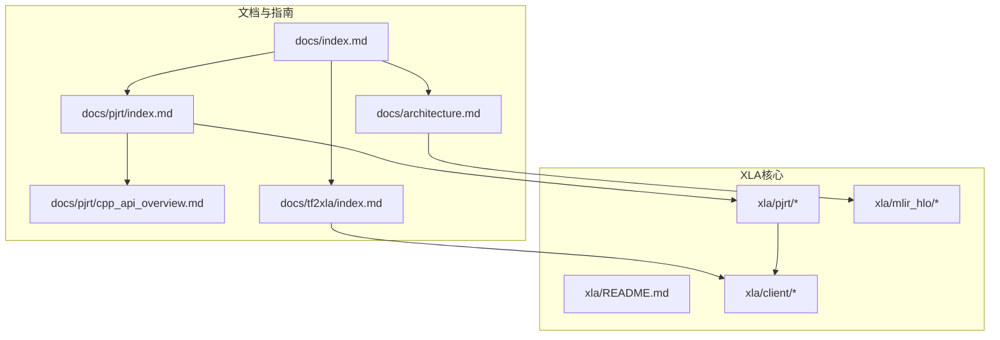
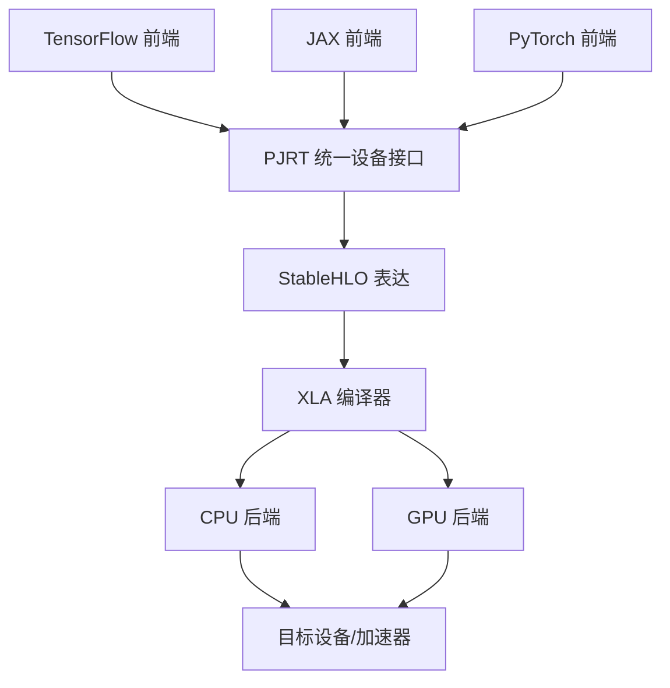
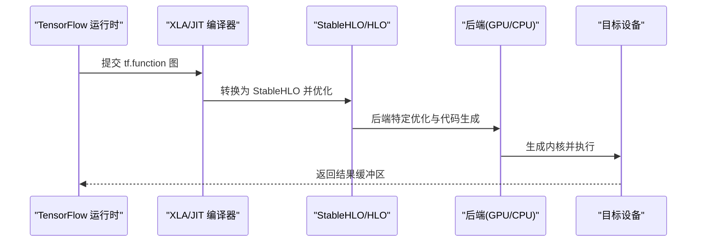
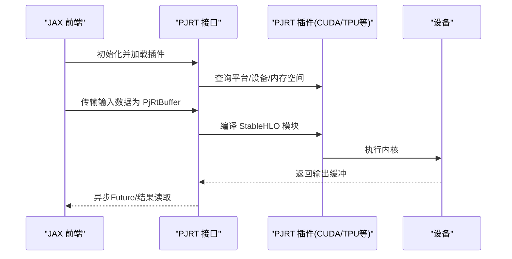
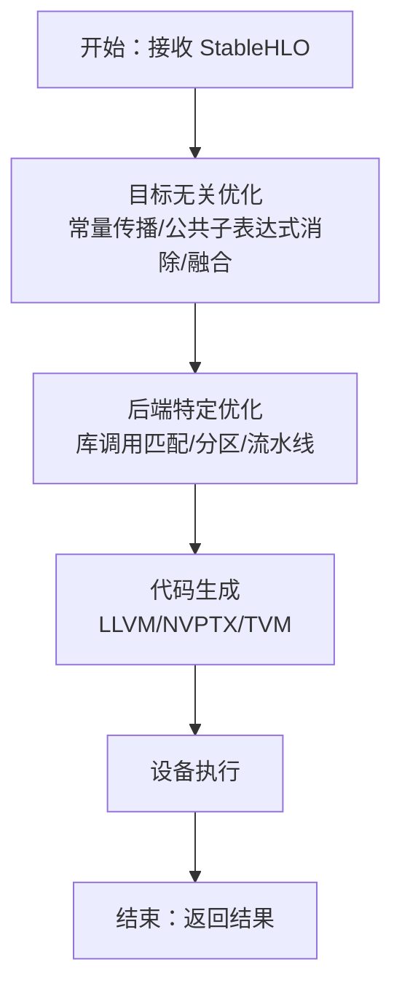
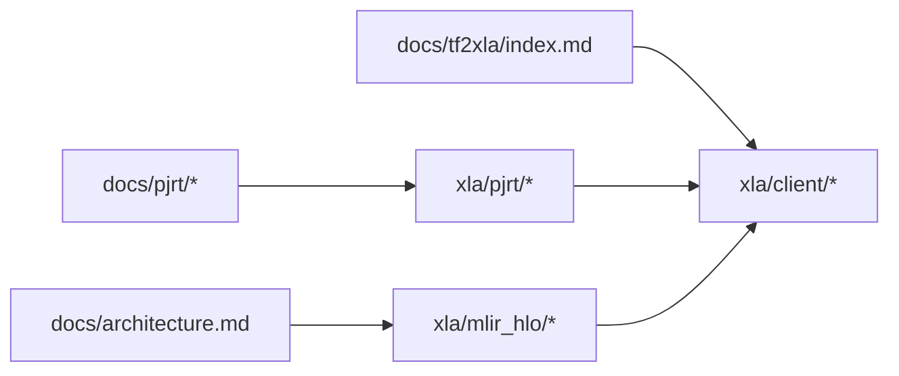

# 框架集成

<cite>
**本文引用的文件**
- [README.md](file://README.md)
- [xla\README.md](file://xla/README.md)
- [docs\index.md](file://docs/index.md)
- [docs\architecture.md](file://docs\architecture.md)
- [docs\pjrt\index.md](file://docs\pjrt\index.md)
- [docs\pjrt\cpp_api_overview.md](file://docs\pjrt\cpp_api_overview.md)
- [docs\pjrt\examples.md](file://docs\pjrt\examples.md)
- [docs\tf2xla\index.md](file://docs\tf2xla\index.md)
</cite>

## 目录
1. [简介](#简介)
2. [项目结构](#项目结构)
3. [核心组件](#核心组件)
4. [架构总览](#架构总览)
5. [组件详解](#组件详解)
6. [依赖关系分析](#依赖关系分析)
7. [性能考量](#性能考量)
8. [故障排查指南](#故障排查指南)
9. [结论](#结论)
10. [附录](#附录)

## 简介
本文件面向希望将XLA与主流机器学习框架（TensorFlow、PyTorch、JAX）集成的开发者，系统阐述XLA在各框架中的作用机制、编译流程、API使用模式、配置选项与最佳实践，并提供可追溯到源码的参考路径与图示，帮助读者快速落地模型优化。

XLA是面向加速线性代数的开源机器学习编译器，支持在GPU、CPU与各类机器学习加速器上进行高性能执行。作为OpenXLA项目的一部分，XLA通过稳定的高层算子语言（StableHLO）与统一设备接口（PJRT）实现跨框架、跨硬件的一致优化体验。

章节来源
- file://README.md#L1-L50
- file://docs\index.md#L1-L39

## 项目结构
该仓库包含XLA核心编译器、后端适配、PJRT统一设备接口、文档与工具等模块。与“框架集成”直接相关的关键位置如下：
- docs：官方文档索引与架构、PJRT、TF2XLA等专题文档
- xla：XLA核心源码与后端（CPU/GPU/解释器等）
- xla/pjrt：PJRT C/C++ API与插件机制
- xla/mlir_hlo：StableHLO/MHLO转换与工具链
- xla/client：客户端与编译接口（面向前端的桥接层）

图表来源
- [docs\index.md](file://docs\index.md#L1-L39)
- [docs\architecture.md](file://docs\architecture.md#L1-L72)
- [docs\pjrt\index.md](file://docs\pjrt\index.md#L1-L32)
- [docs\pjrt\cpp_api_overview.md](file://docs\pjrt\cpp_api_overview.md#L1-L334)
- [docs\tf2xla\index.md](file://docs\tf2xla\index.md#L1-L235)
- [xla\README.md](file://xla\README.md#L1-L103)

章节来源
- file://xla\README.md#L1-L103
- file://docs\index.md#L1-L39

## 核心组件
- 编译管线与StableHLO
  - XLA以StableHLO为前端稳定表示，完成目标无关优化后进入后端特定优化与代码生成。
  - 参考路径：[docs/architecture.md](file://docs\architecture.md#L35-L72)
- PJRT统一设备接口
  - PJRT提供跨框架的统一设备API，屏蔽底层硬件差异；框架侧通过PJRT调用后端插件。
  - 参考路径：[docs/pjrt/index.md](file://docs\pjrt\index.md#L6-L32)、[docs/pjrt/cpp_api_overview.md](file://docs\pjrt\cpp_api_overview.md#L1-L334)
- 客户端与编译接口
  - xla/client提供编译与执行的高层接口，面向前端（如TensorFlow/JAX）进行桥接。
  - 参考路径：[xla/README.md](file://xla\README.md#L13-L17)

章节来源
- file://docs\architecture.md#L35-L72
- file://docs\pjrt\index.md#L6-L32
- file://docs\pjrt\cpp_api_overview.md#L1-L334
- file://xla\README.md#L13-L17

## 架构总览
下图展示了XLA在主流框架中的集成位置与数据流：框架前端（TF/JAX/PyTorch）通过统一的PJRT接口提交计算图，XLA接收StableHLO并进行优化与代码生成，最终在目标设备上执行。

图表来源
- [docs\architecture.md](file://docs\architecture.md#L35-L72)
- [docs\pjrt\index.md](file://docs\pjrt\index.md#L6-L32)

## 组件详解

### TensorFlow 集成（XLA:GPU 与自动聚类）
- 启用方式
  - 显式编译：通过函数装饰器开启XLA编译，具备“必须编译”语义，失败抛异常。
  - 自动聚类：设置环境变量以自动识别可编译子图并融合执行。
- 关键点
  - 形状可推断：维度需可从输入静态推断；动态形状场景可能触发重编译或失败。
  - 分布式策略：可在镜像/多机多卡策略中对step函数标注编译。
  - 调试与导出：可通过环境变量导出中间表示（HLO/LLVM/NVPTX）与图嵌入，便于问题定位。
- 参考路径
  - [docs/tf2xla/index.md](file://docs\tf2xla\index.md#L35-L145)
  - [docs/tf2xla/index.md](file://docs\tf2xla\index.md#L146-L198)

图表来源
- [docs\tf2xla\index.md](file://docs\tf2xla\index.md#L35-L145)
- [docs\architecture.md](file://docs\architecture.md#L35-L72)

章节来源
- file://docs\tf2xla\index.md#L35-L145
- file://docs\tf2xla\index.md#L146-L198

### JAX 集成（PJRT 插件与统一设备API）
- PJRT 设备API
  - 提供统一的C/C++ API，屏蔽设备实现细节；框架侧通过PJRT与后端插件交互。
  - 关键对象：PjRtClient、PjRtDevice、PjRtMemorySpace、PjRtBuffer、PjRtExecutable等。
- 典型流程
  - 加载插件、枚举设备与内存空间、将主机数据转为设备缓冲、编译与执行、异步Future等待结果。
- 参考路径
  - [docs/pjrt/index.md](file://docs\pjrt\index.md#L6-L32)
  - [docs/pjrt/cpp_api_overview.md](file://docs\pjrt\cpp_api_overview.md#L1-L334)
  - [docs/pjrt/examples.md](file://docs\pjrt\examples.md#L1-L39)

图表来源
- [docs\pjrt\cpp_api_overview.md](file://docs\pjrt\cpp_api_overview.md#L1-L334)
- [docs\pjrt\examples.md](file://docs\pjrt\examples.md#L1-L39)

章节来源
- file://docs\pjrt\index.md#L6-L32
- file://docs\pjrt\cpp_api_overview.md#L1-L334
- file://docs\pjrt\examples.md#L1-L39

### PyTorch 集成（通过XLA与PJRT）
- 集成现状与入口
  - XLA通过PyTorch/XLA项目与PyTorch深度集成，用户在PyTorch中使用XLA进行编译与优化。
  - 参考路径：[README.md](file://README.md#L22-L23)
- 建议实践
  - 使用XLA设备上下文管理器切换到XLA后端；
  - 对关键计算图进行编译（如训练step），结合分布式策略（如fsdp/megatron）；
  - 利用XLA调试工具导出中间表示与性能日志，定位瓶颈。
- 参考路径
  - [README.md](file://README.md#L22-L23)

章节来源
- file://README.md#L22-L23

### 编译流程与优化要点
- 流程概览
  - StableHLO目标无关优化 → 后端特定优化（融合/分区/库调用匹配）→ 代码生成（LLVM/NVPTX/TVM等）→ 设备执行。
- 性能优化建议
  - 合理融合：减少中间内存写入与带宽占用；
  - 形状稳定：避免运行时动态形状导致的重编译；
  - 内存布局：利用自定义布局与分片策略；
  - 自动调优：启用自动调优与持久化调优结果。
- 参考路径
  - [docs/architecture.md](file://docs\architecture.md#L35-L72)

图表来源
- [docs\architecture.md](file://docs\architecture.md#L35-L72)

章节来源
- file://docs\architecture.md#L35-L72

### API与配置要点（跨框架）
- TensorFlow
  - 显式编译：函数级装饰器开启XLA；
  - 自动聚类：通过环境变量控制；
  - 调试导出：HLO/LLVM/PTX与图嵌入导出。
  - 参考路径：[docs/tf2xla/index.md](file://docs\tf2xla\index.md#L35-L198)
- JAX
  - 通过PJRT插件接入设备，使用统一缓冲与异步Future；
  - 支持内存空间、自定义布局、通信算子等高级特性。
  - 参考路径：[docs/pjrt/cpp_api_overview.md](file://docs\pjrt\cpp_api_overview.md#L1-L334)
- PyTorch
  - 使用XLA设备与XLA编译器，结合分布式策略；
  - 参考路径：[README.md](file://README.md#L22-L23)

章节来源
- file://docs\tf2xla\index.md#L35-L198
- file://docs\pjrt\cpp_api_overview.md#L1-L334
- file://README.md#L22-L23

## 依赖关系分析
- 文档与实现映射
  - docs/architecture.md 与 xla/mlir_hlo：描述StableHLO到HLO再到后端代码生成的完整链路；
  - docs/pjrt：定义PJRT统一接口与插件机制；
  - docs/tf2xla：给出TensorFlow侧的编译与调试实践；
  - xla/client：提供面向前端的编译与执行接口。
- 外部依赖
  - StableHLO：跨框架的稳定算子集合；
  - MLIR：中间表示与转换工具链；
  - LLVM/NVPTX/TVM：后端代码生成与优化。

图表来源
- [docs\architecture.md](file://docs\architecture.md#L35-L72)
- [docs\pjrt\index.md](file://docs\pjrt\index.md#L6-L32)
- [docs\tf2xla\index.md](file://docs\tf2xla\index.md#L1-L235)
- [xla\README.md](file://xla\README.md#L13-L17)

章节来源
- file://docs\architecture.md#L35-L72
- file://docs\pjrt\index.md#L6-L32
- file://docs\tf2xla\index.md#L1-L235
- file://xla\README.md#L13-L17

## 性能考量
- 融合优先：在XLA中，融合是提升吞吐与降低内存带宽的关键手段；
- 形状稳定：尽量避免运行时动态形状，减少重编译与额外开销；
- 内存布局：合理选择布局与分片策略，减少跨设备/跨内存空间的数据搬运；
- 自动调优：利用自动调优与持久化调优结果，持续优化热点算子；
- 调试导出：通过HLO/LLVM/PTX导出与可视化，定位瓶颈并验证优化效果。

章节来源
- file://docs\architecture.md#L17-L33
- file://docs\tf2xla\index.md#L146-L198

## 故障排查指南
- 导出与复现
  - 使用环境变量导出HLO/LLVM/PTX与图嵌入，便于复现实验与提交问题报告。
  - 参考路径：[docs/tf2xla/index.md](file://docs\tf2xla\index.md#L146-L198)
- 常见问题定位
  - 动态形状导致编译失败：确保维度可从输入静态推断；
  - 自动聚类不生效：检查环境变量与函数作用域（仅tf.function内部会被聚类）。
- 资源与社区
  - 查看PJRT资源与问题反馈渠道，获取最新插件实现与设计文档。
  - 参考路径：[docs/pjrt/index.md](file://docs\pjrt\index.md#L14-L32)

章节来源
- file://docs\tf2xla\index.md#L146-L198
- file://docs\pjrt\index.md#L14-L32

## 结论
XLA通过StableHLO与PJRT实现了跨框架、跨硬件的统一优化能力。在TensorFlow中，XLA提供显式编译与自动聚类两种使用路径；在JAX中，PJRT为设备抽象与插件化提供了坚实基础；在PyTorch中，XLA与XLA设备生态共同推动了端到端优化。结合本文提供的编译流程、API与配置要点，开发者可按需选择合适的集成方式，获得显著的性能收益。

## 附录
- 快速参考
  - TensorFlow：显式编译与自动聚类、调试导出
    - 参考路径：[docs/tf2xla/index.md](file://docs\tf2xla\index.md#L35-L198)
  - JAX：PJRT插件、缓冲与异步Future
    - 参考路径：[docs/pjrt/cpp_api_overview.md](file://docs\pjrt\cpp_api_overview.md#L1-L334)
  - PyTorch：XLA设备与编译器
    - 参考路径：[README.md](file://README.md#L22-L23)
  - 架构与编译管线
    - 参考路径：[docs/architecture.md](file://docs\architecture.md#L35-L72)