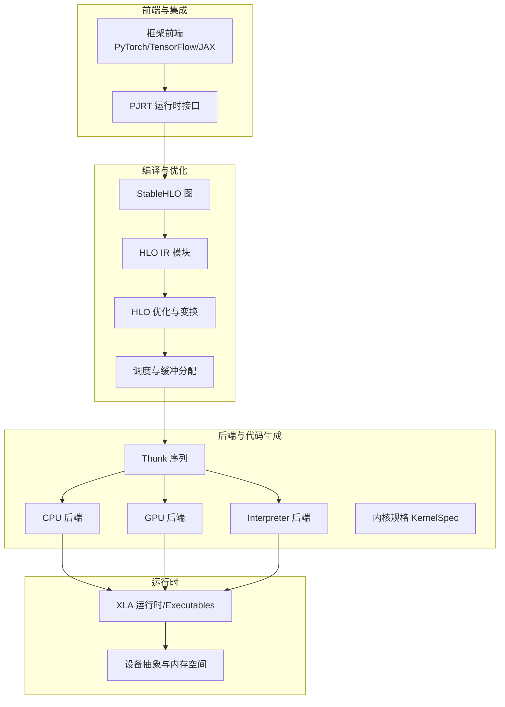
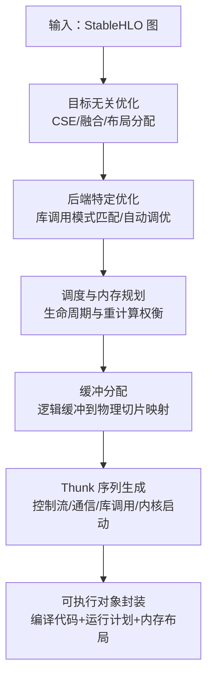
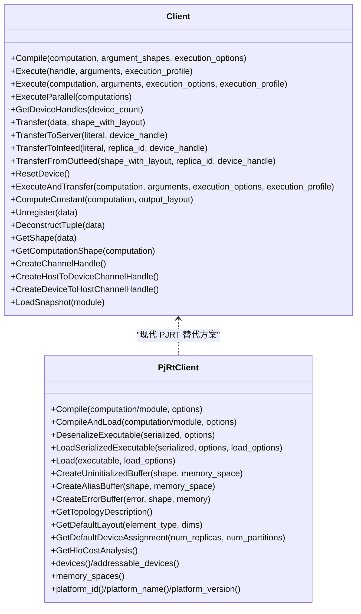
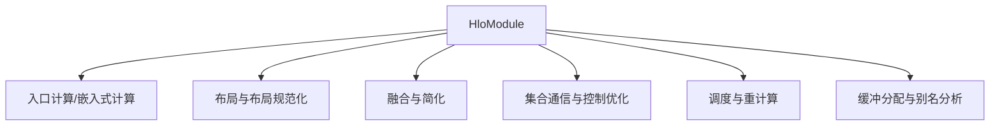
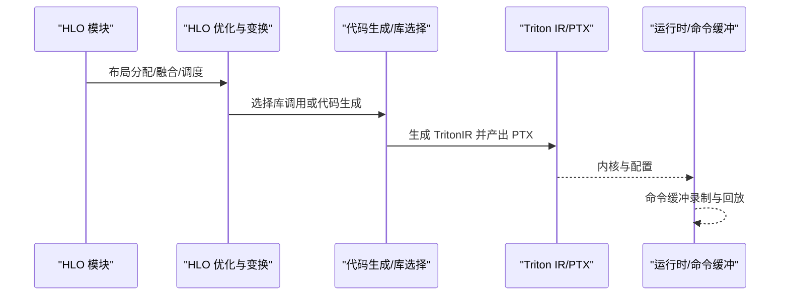
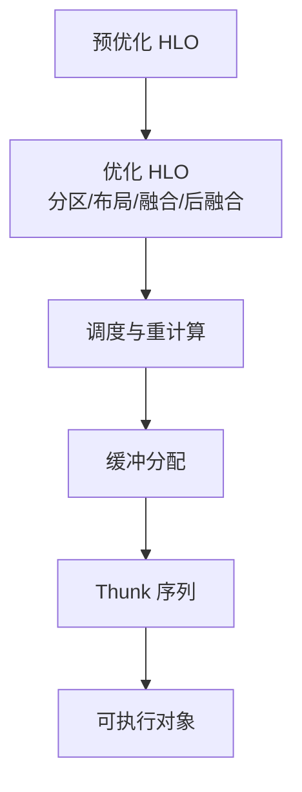
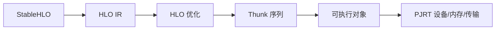

# 项目概览

<cite>
**本文引用的文件**
- [README.md](file://README.md)
- [xla/README.md](file://xla/README.md)
- [docs/architecture.md](file://docs/architecture.md)
- [docs/hlo_to_thunks.md](file://docs/hlo_to_thunks.md)
- [docs/gpu_architecture.md](file://docs/gpu_architecture.md)
- [xla/client/client.h](file://xla/client/client.h)
- [xla/pjrt/pjrt_client.h](file://xla/pjrt/pjrt_client.h)
- [xla/hlo/ir/hlo_module.h](file://xla/hlo/ir/hlo_module.h)
- [xla/codegen/kernel_spec.h](file://xla/codegen/kernel_spec.h)
</cite>

## 目录
1. [引言](#引言)
2. [项目结构](#项目结构)
3. [核心组件](#核心组件)
4. [架构总览](#架构总览)
5. [详细组件分析](#详细组件分析)
6. [依赖关系分析](#依赖关系分析)
7. [性能考量](#性能考量)
8. [故障排查指南](#故障排查指南)
9. [结论](#结论)
10. [附录](#附录)

## 引言
XLA（Accelerated Linear Algebra）是面向机器学习的加速线性代数编译器，目标是在多类硬件（CPU、GPU、ML加速器）上实现高性能推理与训练执行。它通过将来自主流框架（如 PyTorch、TensorFlow、JAX）的模型图转换为 StableHLO，并在后端进行优化与代码生成，从而提升执行速度、降低内存占用、减少对自定义算子的依赖，并增强跨硬件的可移植性。

本概览面向初学者与有经验的开发者，既提供概念性说明，也给出与代码库一致的术语与架构视图，并结合常见用例与接口说明帮助快速上手。

## 项目结构
仓库采用模块化组织方式，围绕“前端（StableHLO）—中间表示（HLO）—后端（CPU/GPU/Interpreter 等）—运行时（PJRT/传统服务）”的分层设计展开。顶层 README 提供项目定位与入口；xla/README 指明当前迁移与目录重构方向；docs 下包含架构、GPU 架构、HLO 到 Thunks 的流程等文档；核心源码分布在 backends、hlo、codegen、pjrt、service 等目录中。

**图示来源**
- [docs/architecture.md](file://docs/architecture.md#L35-L72)
- [docs/hlo_to_thunks.md](file://docs/hlo_to_thunks.md#L1-L278)
- [docs/gpu_architecture.md](file://docs/gpu_architecture.md#L1-L254)
- [xla/README.md](file://xla/README.md#L19-L103)

**章节来源**
- [README.md](file://README.md#L1-L50)
- [xla/README.md](file://xla/README.md#L1-L103)

## 核心组件
- 客户端接口：提供编译、执行、数据传输、通道管理等能力，支持传统服务客户端与现代 PJRT 客户端两类入口。
- HLO 模块：描述完整的程序单元，包含入口计算、嵌入式计算、布局、调度、元数据等，是编译与优化的核心 IR。
- 编译管线：从 StableHLO 到 HLO，再到后端特定优化、调度、缓冲分配、Thunk 序列生成与最终可执行对象。
- 后端与代码生成：CPU/GPU 后端分别负责 LLVM/PTX/Triton 等代码生成与内核规格描述；KernelSpec 描述工作维度、缓冲区与片上临时内存需求。
- 运行时：Executables 封装编译产物与运行计划；PJRT 抽象设备、内存空间、跨主机/跨设备传输与异步事件。

**章节来源**
- [xla/client/client.h](file://xla/client/client.h#L42-L227)
- [xla/pjrt/pjrt_client.h](file://xla/pjrt/pjrt_client.h#L509-L800)
- [xla/hlo/ir/hlo_module.h](file://xla/hlo/ir/hlo_module.h#L94-L120)
- [xla/codegen/kernel_spec.h](file://xla/codegen/kernel_spec.h#L41-L119)

## 架构总览
XLA 的总体目标与工作流如下：
- 目标：提升执行速度、改善内存使用、减少自定义算子依赖、增强跨硬件可移植性。
- 流程：StableHLO → 目标无关优化 → 后端特定优化 → 调度与缓冲分配 → Thunk 序列 → 可执行对象（CPU/GPU/Interpreter）。

**图示来源**
- [docs/architecture.md](file://docs/architecture.md#L35-L72)
- [docs/hlo_to_thunks.md](file://docs/hlo_to_thunks.md#L1-L278)

## 详细组件分析

### 客户端与执行接口
- 传统服务客户端（xla/client）：提供编译、执行、并行执行、设备句柄、数据传输（Infeed/Outfeed）、常量求值、形状查询、通道创建等能力。
- 现代 PJRT 客户端（xla/pjrt）：抽象设备、内存空间、默认布局、编译选项、序列化/加载可执行、跨主机/跨设备传输、异步事件等，统一多后端接入。

**图示来源**
- [xla/client/client.h](file://xla/client/client.h#L42-L227)
- [xla/pjrt/pjrt_client.h](file://xla/pjrt/pjrt_client.h#L509-L800)

**章节来源**
- [xla/client/client.h](file://xla/client/client.h#L49-L165)
- [xla/pjrt/pjrt_client.h](file://xla/pjrt/pjrt_client.h#L634-L696)

### HLO 模块与优化
- HloModule 是 HLO IR 的顶层容器，包含入口计算、嵌入式计算、布局、调度、别名配置、元数据等。
- 典型优化路径：SPMD 分区、布局分配、规范化、融合、收集通信优化、复制插入、重计算与调度选择。

**图示来源**
- [xla/hlo/ir/hlo_module.h](file://xla/hlo/ir/hlo_module.h#L94-L120)
- [docs/hlo_to_thunks.md](file://docs/hlo_to_thunks.md#L19-L124)

**章节来源**
- [xla/hlo/ir/hlo_module.h](file://xla/hlo/ir/hlo_module.h#L94-L120)
- [docs/hlo_to_thunks.md](file://docs/hlo_to_thunks.md#L19-L124)

### GPU 后端与 Triton 代码生成
- GPU 后端结合 LLVM/PTX 与 TritonIR，针对 GEMM/Softmax/LayerNorm 等融合生成高性能内核。
- 通过 KernelSpec 描述工作集群/组/项维度、参数/结果缓冲区、不变参数集合与片上临时内存需求。

**图示来源**
- [docs/gpu_architecture.md](file://docs/gpu_architecture.md#L20-L254)
- [docs/hlo_to_thunks.md](file://docs/hlo_to_thunks.md#L168-L278)
- [xla/codegen/kernel_spec.h](file://xla/codegen/kernel_spec.h#L41-L119)

**章节来源**
- [docs/gpu_architecture.md](file://docs/gpu_architecture.md#L20-L254)
- [xla/codegen/kernel_spec.h](file://xla/codegen/kernel_spec.h#L41-L119)

### 从 HLO 到 Thunks 的编译流程
- 阶段划分：预优化 HLO → 优化 HLO（分区/优化/布局/融合/后融合）→ 调度 → 缓冲分配 → Thunk 序列 → 可执行对象。
- GPU 特性：命令缓冲（CUDA/HIP Graphs）用于复用内核启动开销，提升小内核密集场景性能。

**图示来源**
- [docs/hlo_to_thunks.md](file://docs/hlo_to_thunks.md#L1-L278)

**章节来源**
- [docs/hlo_to_thunks.md](file://docs/hlo_to_thunks.md#L1-L278)

## 依赖关系分析
- 前端到后端：StableHLO 作为跨框架的稳定接口，确保编译器与具体框架解耦。
- 优化与后端：HLO 层面的目标无关优化与后端特定优化相互配合，平衡吞吐与内存。
- 运行时抽象：PJRT 统一设备/内存/传输语义，Executables 封装后端特定产物。

**图示来源**
- [docs/architecture.md](file://docs/architecture.md#L35-L72)
- [docs/hlo_to_thunks.md](file://docs/hlo_to_thunks.md#L168-L278)
- [xla/pjrt/pjrt_client.h](file://xla/pjrt/pjrt_client.h#L509-L800)

**章节来源**
- [docs/architecture.md](file://docs/architecture.md#L35-L72)
- [docs/hlo_to_thunks.md](file://docs/hlo_to_thunks.md#L168-L278)

## 性能考量
- 融合优先：通过优先级融合与多输出融合减少中间存储写回，提升带宽利用率。
- 布局优化：布局分配与规范化减少隐式转置，显式布局便于代码生成器优化。
- 调度与重计算：在峰值内存受限时，通过重计算与调度选择平衡内存与吞吐。
- 命令缓冲：对连续内核序列进行录制与回放，显著降低小内核启动开销。
- 自动调优：在融合与算法选择阶段进行自动调优，选取最优分块与流水参数。

[本节为通用指导，无需列出章节来源]

## 故障排查指南
- 执行与编译错误：利用执行配置与剖析信息定位热点；检查设备句柄与布局一致性。
- 数据传输问题：确认 Infeed/Outfeed 形状与布局、副本编号与设备句柄；跨主机传输需保证描述符配对与取消机制正确。
- 调度与内存：若出现内存不足，考虑减小批大小或启用重计算；检查融合边界与缓冲分配日志。
- 调试工具：使用 HLO 转储与可视化辅助定位布局冲突、复制插入与融合效果。

**章节来源**
- [xla/client/client.h](file://xla/client/client.h#L110-L165)
- [xla/pjrt/pjrt_client.h](file://xla/pjrt/pjrt_client.h#L460-L509)
- [docs/hlo_to_thunks.md](file://docs/hlo_to_thunks.md#L125-L167)

## 结论
XLA 通过稳定的前端接口与强大的中间表示，实现了在 CPU/GPU/ML 加速器上的高效执行。其优化链路覆盖从 StableHLO 到 HLO、调度与缓冲分配、再到 Thunk 序列与可执行对象的全链路。现代 PJRT 接口进一步统一了多后端接入与设备/内存抽象，使框架集成与跨硬件部署更为简单可靠。

[本节为总结性内容，无需列出章节来源]

## 附录

### 常见用例与接口要点
- 使用传统客户端编译与执行：提供计算图、参数形状与执行选项，返回可执行句柄或直接执行并返回结果。
- 使用 PJRT 客户端：通过编译选项与默认布局策略生成可加载可执行，支持序列化/反序列化与跨设备传输。
- GPU 融合与布局：关注布局分配与融合策略，结合自动调优参数获得更佳性能。
- 调度与缓冲：在内存受限场景下，合理使用重计算与调度策略以平衡内存与吞吐。

**章节来源**
- [xla/client/client.h](file://xla/client/client.h#L67-L101)
- [xla/pjrt/pjrt_client.h](file://xla/pjrt/pjrt_client.h#L634-L696)
- [docs/gpu_architecture.md](file://docs/gpu_architecture.md#L130-L207)
- [docs/hlo_to_thunks.md](file://docs/hlo_to_thunks.md#L125-L167)